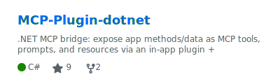
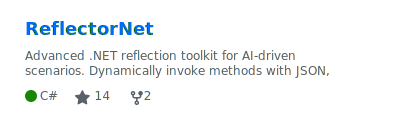
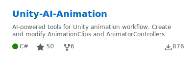
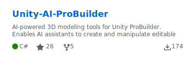
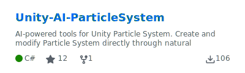
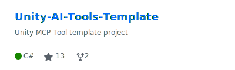

  <h1>Ivan Murzak</h1>
  <code>AI Tools</code> • <code>AI Agents</code> • <code>LLMs</code> • <code>.NET</code> • <code>Unity</code> • <code>Game Dev</code>
   
  

    
    
    
    
    
    
  

AI-focused Software Engineer and open-source maintainer building AI-powered developer tools, AI agents and LLM integrations for real production environments.
My work focuses on practical AI adoption: agent tooling, automation, developer productivity, and bridging AI systems with existing C# / .NET and Unity ecosystems.

> - Creator of [AI Game Developer](https://github.com/IvanMurzak/Unity-MCP) — the most popular open-source AI assistent for Unity Engine.
> - Inventor and creator of [MCP Plugin](https://github.com/IvanMurzak/MCP-Plugin-dotnet) concept and [ReflectorNet](https://github.com/IvanMurzak/ReflectorNet) for .NET
> - Former startup co-founder and creator of the successful game *[Evil Cogs](https://www.youtube.com/watch?v=tJRztGsD7PE)*, with over 5 million installs.

**Master's degree in Computer Science**, with a deep passion for AI engineering, software engineering and game development.

  

<h1 align="center">AI Packages</h1>

My AI project and solutions for .NET

<h1 align="center">Unity Packages</h1>

My the most popular packages for Unity Engine

 

<h2 align="center"> </h1>

 

  

