

  <h1>Ivan Murzak</h1>

  

    
    
    
    
    
    
  

<a href="https://github.com/IvanMurzak">
  <picture>
    <source media="(prefers-color-scheme: dark)" srcset="images/stats/github-stats-dark.svg">
    
  </picture>
</a>
<a href="https://github.com/IvanMurzak">
  <picture>
    <source media="(prefers-color-scheme: dark)" srcset="images/stats/streak-stats-dark.svg">
    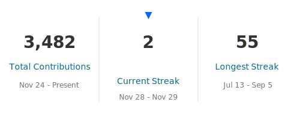
  </picture>
</a>

  <h2>About Me</h2>

🎮 Senior Unity Developer specializing in mobile games for Android and iOS.
🚀 Former startup co-founder and creator of the successful game *Evil Cogs*, with over 5 million installs.
💻 Master's degree in Computer Science, with a deep passion for software engineering and game development.
🌍 Originally from Ukraine :ukraine:, now based in the Greater Seattle Area, WA, USA.

 
<h1 align="center">Unity packages</h1>

I am open source contributor

There are my the most popular packages for Unity Engine

 

<a href="https://github.com/IvanMurzak/Unity-MCP">
  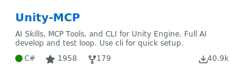
</a>
<a href="https://github.com/IvanMurzak/Unity-ImageLoader">
  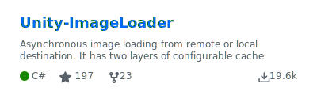
</a>
<a href="https://github.com/IvanMurzak/Unity-Theme">
  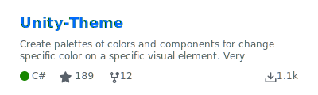
</a>
<a href="https://github.com/IvanMurzak/Unity-Gyroscope-Parallax">
  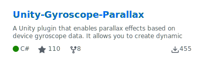
</a>
<a href="https://github.com/IvanMurzak/Unity-Package-Template">
  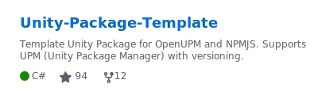
</a>
<a href="https://github.com/IvanMurzak/Unity-Mouse-Parallax">
  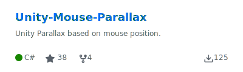
</a>
<a href="https://github.com/IvanMurzak/Unity-PlayerPrefsEx">
  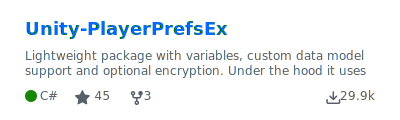
</a>
<a href="https://github.com/IvanMurzak/Unity-EFCore-SQLite">
  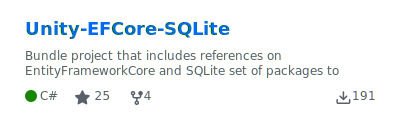
</a>
<a href="https://github.com/IvanMurzak/Unity-Saver">
  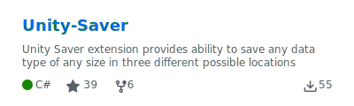
</a>
<a href="https://github.com/IvanMurzak/Unity-AudioLoader">
  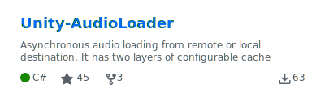
</a>
<a href="https://github.com/IvanMurzak/Unity-IAP-Store">
  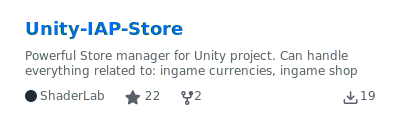
</a>
<a href="https://github.com/IvanMurzak/Unity-NonDrawingGraphic">
  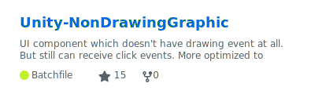
</a>
<a href="https://github.com/IvanMurzak/UBuilder">
  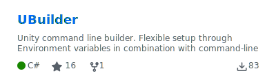
</a>

<a href="https://github.com/IvanMurzak/Unity-Appodeal-Simplifier">
  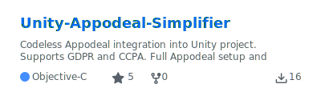
</a>
<a href="https://github.com/IvanMurzak/Unity-Gyroscope-Manager">
  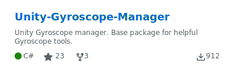
</a>
<a href="https://github.com/IvanMurzak/Unity-Extensions">
  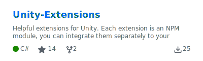
</a>
<a href="https://github.com/IvanMurzak/Unity-iOS-Pods-Bitcode">
  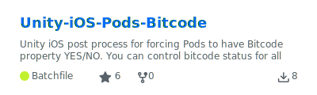
</a>
<a href="https://github.com/IvanMurzak/Unity-Mobile-Notifications-Simplifier">
  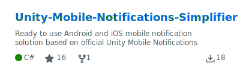
</a>

 

<h2 align="center"> </h1>

 

  

